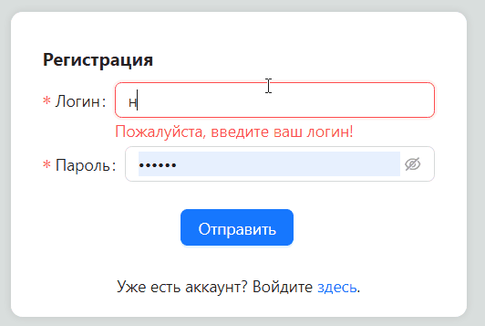
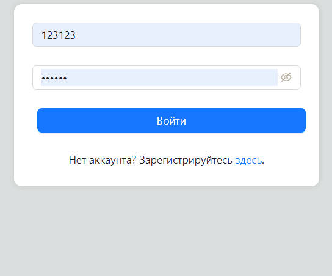
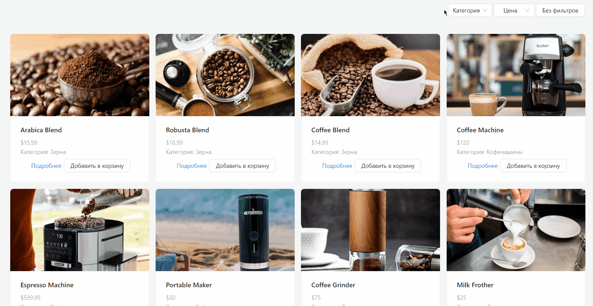
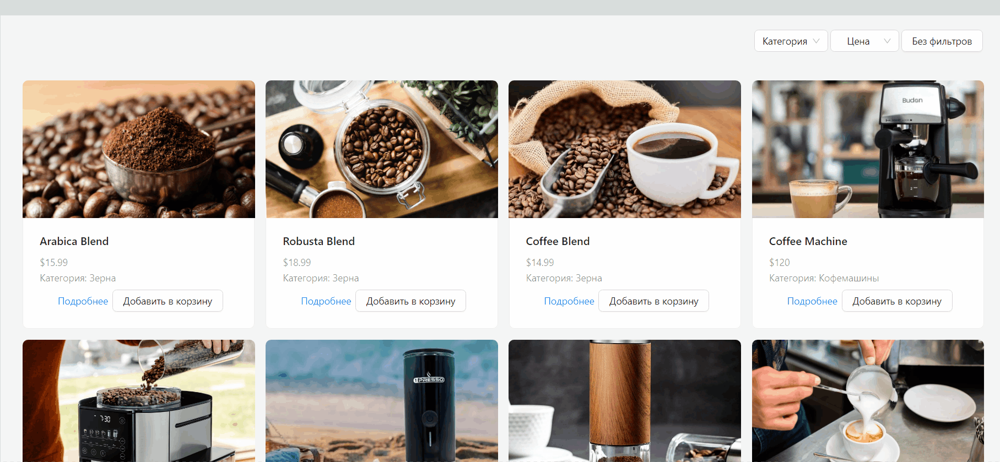
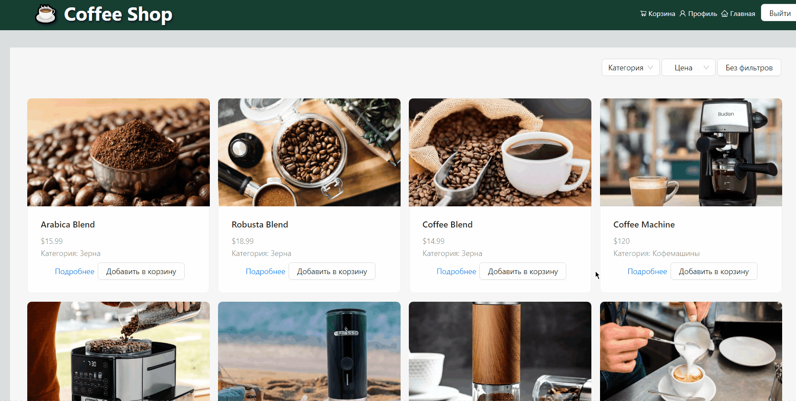
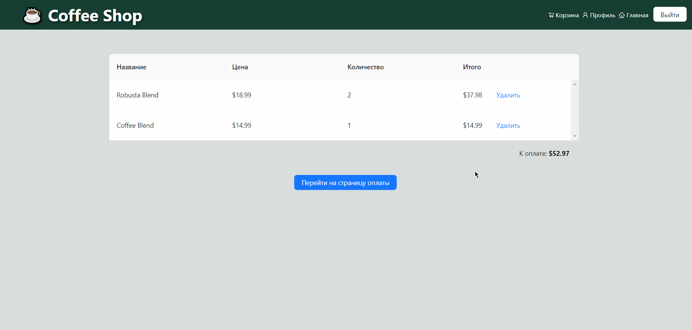
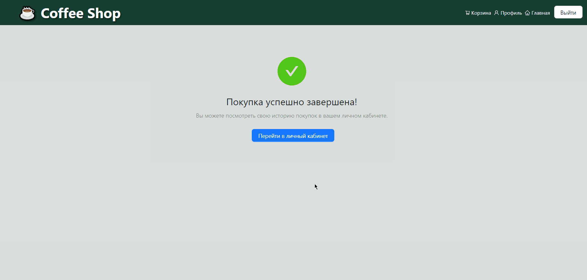
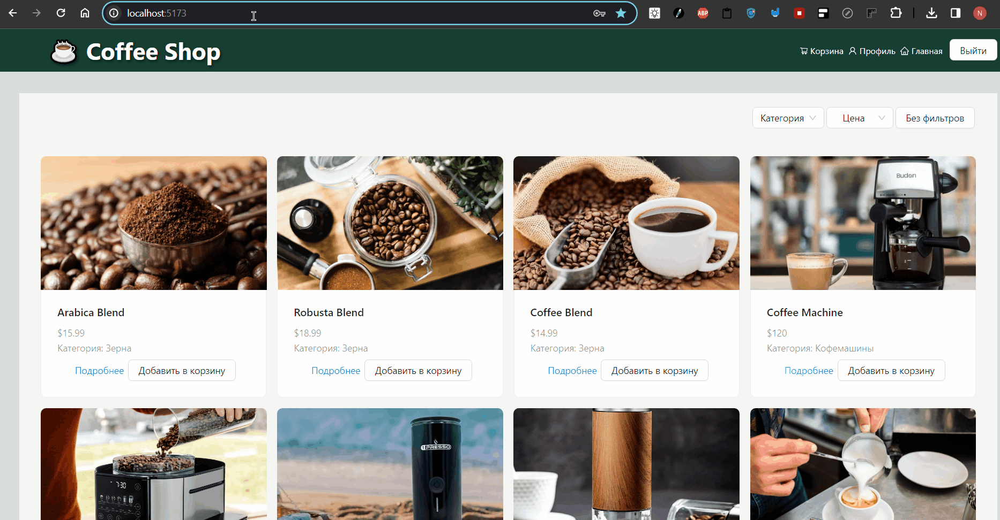

Live demo: [coffee-store-three.vercel.app](https://coffee-store-three.vercel.app/)

# Проект "Coffee Store"

**Проект "Coffee Store"** — это веб-приложение на базе React, имитирующее работу магазина по продаже кофе, с функциями регистрации пользователей, просмотра и добавления товаров, управления корзиной покупок, оформления заказов и просмотра истории покупок.

## Технологический стек

  
  
   
  
  
  

В приложении используется **Vite** для сборки, **React Router** для маршрутизации, **MobX** для управления состоянием, **SASS** для удобного написания стилей и **Ant Design (AntD)** в качестве основной библиотеки компонентов пользовательского интерфейса.

## Модель ветвления

В процессе работы над приложением я придерживался модели ветвления **GitFlow**:

  

## Функционал

### Страницы Login и SignUp (`/login` & `/signup`)

- **Используемые хранилища MobX:** `AuthStore`
- **Функционал:** Обеспечивают регистрацию и вход пользователя в приложение.
- **Реализует компоненты Form и Input Ant Design** для пользовательского ввода.
- `AuthStore` управляет аутентификацией пользователя, включая `signIn()` для входа и `signUp()` для регистрации, используя локальное хранилище для управления сессиями. Это связано с тем, что это учебное приложение, и для простоты информация о пользователе хранится на стороне клиента, а не на сервере.

   
  

- **Результат:** Успешный вход предоставляет доступ к дополнительным функциям, например, просмотру истории покупок или оформлению заказа.

### Страница Home (`/`)

- **Используемые хранилища MobX:** `ProductStore`
- **Функционал:** Демонстрирует карточки товаров с категориями и фильтрами.
- Использует **Select от Ant Design** для фильтрации по категориям и **компоненты карточек** для отображения продуктов.
- **Отзывчивый дизайн** достигается с использованием **Row** и **Col от Ant Design**, обеспечивая комфортный UX на разных устройствах.

- **ProductStore** извлекает и фильтрует продукты по категориям (`filterByCategory()`) и сортирует их по цене (`sortByPrice()`), динамически обновляя UI на основе взаимодействия пользователя.

### Страница ProductDetails (`/product/:id`)

- **Используемые хранилища MobX:** `ProductStore`, `BasketStore`
- **Функционал:** Отображает подробную информацию о выбранном продукте.
- Подробный просмотр включает изображения продуктов, цены и описания, предоставляемые `ProductStore.findById()`.

### Страница Basket (`/basket`)

- **Используемые хранилища MobX:** `BasketStore`
- **Функционал:** Отоборажает список товаров в корзине покупок.
- **Компонент Table от Ant Design** используется для списка выбранных продуктов, демонстрируя название продукта, цену, количество и общую сумму.

### Страница Checkout (`/checkout`)

- **Используемые хранилища MobX:** `BasketStore`, `PurchaseHistoryStore`
- **Функционал:** Обеспечивает оплату заказа.
- **Использует компоненты ввода и формы от Ant Design** для сбора платежной информации.

### Страница Profile (`/profile`)

- **Используемые хранилища MobX:** `AuthStore`, `PurchaseHistoryStore`
- **Функционал:** Отображает личный профиль пользователя, включая его историю покупок.
- **Использует таблицу от Ant Design** для списка истории покупок.

### Страница NotFound (обработчик несуществующих роутов)

- **Функционал:** Предупреждает пользователя о том, что запрашиваемый ресурс не найден.
- Использует **компонент Result от Ant Design** для представления сообщения об ошибке.

### Компонент AuthRoute

- **Используемые хранилища MobX:** `AuthStore`
- **Функционал:** Проверяет статус аутентификации пользователя через `authStore.isSignedIn`. Если пользователь не вошел в систему, он перенаправляется на страницу регистрации, обеспечивая доступ к защищенным маршрутам только для аутентифицированных пользователей.

## Локальный запуск проекта

### Клонирование репозитория

Сначала склонируйте репозиторий на ваше локальное устройство с помощью следующей команды Git:

<code>git clone https://github.com/nick6850/coffee_store.git</code>

### Переход в папку проекта

После клонирования репозитория перейдите в папку проекта с помощью команды:

<code>cd coffee_store</code>

### Установка зависимостей проекта

Установите необходимые зависимости проекта, выполнив следующую команду:

<code>npm install</code>

### Запуск сервера разработки

Чтобы запустить сервер разработки, используйте следующую команду:

<code>npm run dev</code>

После выполнения этой команды, Vite запустит сервер разработки. По умолчанию, вы сможете получить доступ к приложению по адресу [http://localhost:3000](http://localhost:3000) в вашем веб-браузере.
